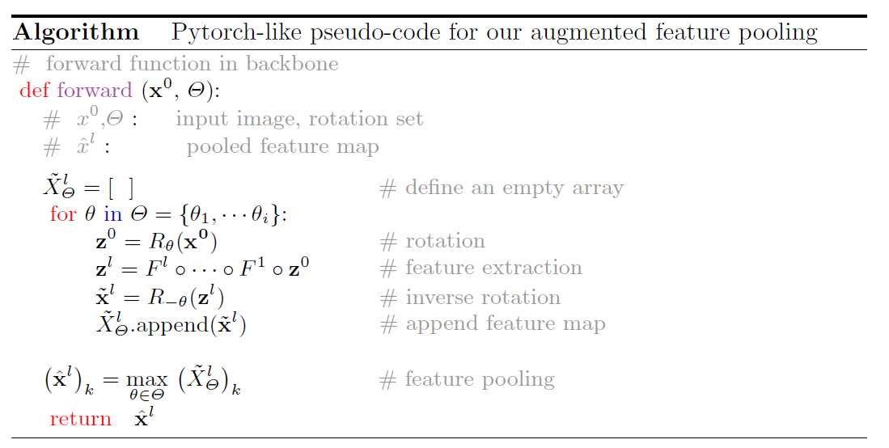
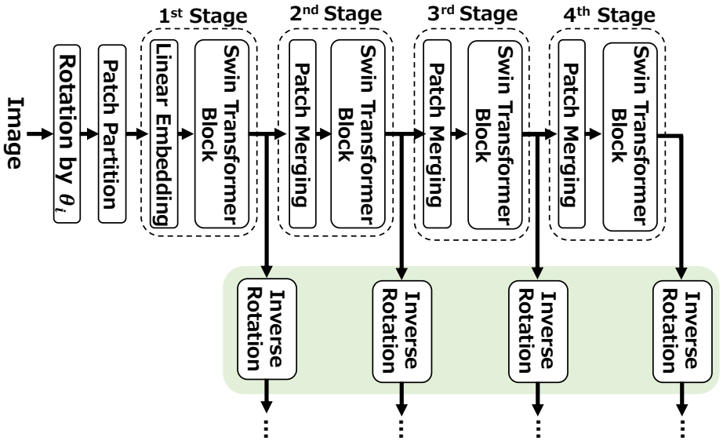

# AFP:Robustizing Object Detection Networks Using Augmented Feature Pooling (ACCV2022, Oral)

This is an official PyTorch impelementation of our paper  "[Robustizing Object Detection Networks Using Augmented Feature Pooling  (ACCV2022, Oral)](https://openaccess.thecvf.com/content/ACCV2022/papers/Shibata_Robustizing_Object_Detection_Networks_Using_Augmented_Feature_Pooling_ACCV_2022_paper.pdf)" 

<p align="center">

</p>

## 1. Getting Started
Our implementation is based on MMDetection v2.19.0.

To merge code with mmdetection run the following shell.

`sh ./merge_mmdet.sh`

## 2. Training 
Train Our Augmentation Feature Pooling with Faster RCNN on Our COCO-Rot-Train.

`bash ./tools/Faster/dist_faster_Prop_FT4.sh`

Train naive Faster RCNN on Our COCO-Rot-Train.

`bash ./tools/Faster/dist_faster_Prev.sh`


## 3. Directory Configuration

```
DET_AFP  
├── mmdet  
├── tools  
├── configs  
├── data  
│   ├── coco  
│   │   ├── annotations  
│   │   ├── train2017  
│   │   ├── val2017  
│   │   ├── test2017  
```

NOTE: In our implementation coco-rot2 (rotated version of MS COCO) is located in the upper directory as followings:

```
mmdetection 
├── wrok  
│   ├── DET_AFP  
│
├── data  
│   ├── coco-rot2  
│   │   ├── annotations  
│   │   ├── train2017  
│   │   ├── val2017  
│   │   ├── test2017  
```

The location of the dataset is arbitrary, but you will need to change the description below according to your location.

`data_root = data_root = "../../mmdetection/data/coco_rot2/" ` 

in

 `configs/_base_/datasets/coco_detection_ROT2.py`


## 4. Pseudo-Code for Our Augmented Feature Pooling

<p align="center">

</p>

## 5. Extension to Transformer-Based Backbone

For Swin Transformer, our augmented feature pooling is applied to the
feature map immediately after the Swin-Transformer Block of each stage, i.e.
just before the Patch Merging.

<p align="center">

</p>


## Citation
If you use this toolbox or benchmark in your research, please cite this project.  
```BibTeX
@inproceedings{shibata2022robustizing,  
  title={Robustizing Object Detection Networks Using Augmented Feature Pooling},  
  author={Shibata, Takashi and Tanaka, Masayuki and Okutomi, Masatoshi},  
  booktitle={Proceedings of the Asian Conference on Computer Vision},  
  pages={2388--2405},  
  year={2022}  
}
```
