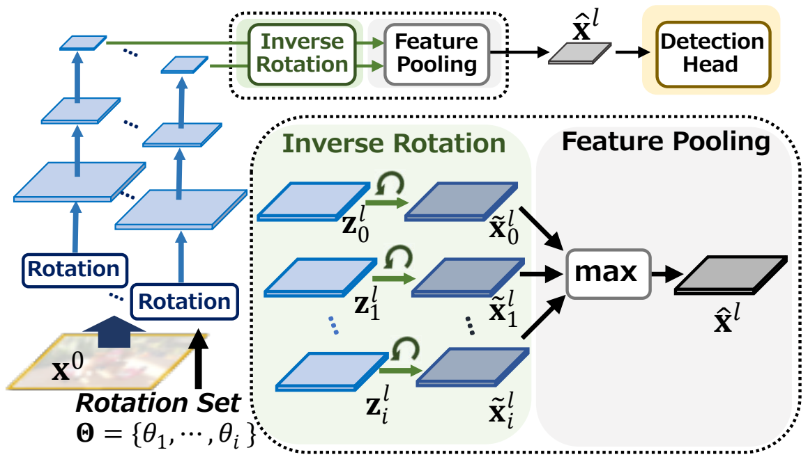

# AFP:Robustizing Object Detection Networks Using Augmented Feature Pooling (ACCV2022)
This is the official PyTorch impelementation of our paper "Robustizing Object Detection Networks Using Augmented Feature Pooling" (ACCV2022).

<p align="center">

</p>

## Setup
Our implementation is based on MMDetection v2.19.0.

To merge code with mmdetection run the following shell.

`sh ./merge_mmdet.sh`

## To train a model with the new config, you can simply run
Train Our Augmentation Feature Pooling with Faster RCNN on Our COCO-Rot-Train.

`bash ./tools/Faster/dist_faster_Prop_FT4.sh`

Train naive Faster RCNN on Our COCO-Rot-Train.

`bash ./tools/Faster/dist_faster_Prev.sh`


## Directory configuration

```
DET_AFP  
├── mmdet  
├── tools  
├── configs  
├── data  
│   ├── coco  
│   │   ├── annotations  
│   │   ├── train2017  
│   │   ├── val2017  
│   │   ├── test2017  
```

NOTE: In our implementation coco-rot2 (rotated version of MS COCO) is located in the upper directory as followings:

```
mmdetection 
├── wrok  
│   ├── DET_AFP  
│
├── data  
│   ├── coco-rot2  
│   │   ├── annotations  
│   │   ├── train2017  
│   │   ├── val2017  
│   │   ├── test2017  
```

The location of the dataset is arbitrary, but you will need to change the description below according to your location.

`data_root = data_root = "../../mmdetection/data/coco_rot2/" ` in `configs/_base_/datasets/coco_detection_ROT2.py`

## Citation
If you use this toolbox or benchmark in your research, please cite this project.  
```
@inproceedings{shibata2022robustizing,  
  title={Robustizing Object Detection Networks Using Augmented Feature Pooling},  
  author={Shibata, Takashi and Tanaka, Masayuki and Okutomi, Masatoshi},  
  booktitle={Proceedings of the Asian Conference on Computer Vision},  
  pages={2388--2405},  
  year={2022}  
}
```
